# ドキュメント

## 目次
- [ドキュメント](#ドキュメント)
  - [目次](#目次)
  - [GitHub の登録方法](#github-の登録方法)
  - [GitHub Codespace 向けの開発環境構築](#github-codespace-向けの開発環境構築)
  - [Windows 向けの開発環境構築](#windows-向けの開発環境構築)
  - [Nuxt3とは](#nuxt3とは)
    - [Nuxt3の概要](#nuxt3の概要)
    - [基本的なフォルダ構成とその説明](#基本的なフォルダ構成とその説明)
  - [プロジェクトの構成](#プロジェクトの構成)
  - [ファイル修正の影響範囲一覧](#ファイル修正の影響範囲一覧)
  - [定期修正箇所一覧](#定期修正箇所一覧)
    - [マイナビ/リクナビリンク、画層差し替え（1年に1度で発生）](#マイナビリクナビリンク画層差し替え1年に1度で発生)
    - [プライバシーマークの入れ替え（2年に一度発生）](#プライバシーマークの入れ替え2年に一度発生)
    - [社員紹介入れ替え手順（不定期で発生）](#社員紹介入れ替え手順不定期で発生)
    - [オフィス紹介写真の入替手順（不定期で発生）](#オフィス紹介写真の入替手順不定期で発生)
    - [地図の修正・更新方法（不定期で発生）](#地図の修正更新方法不定期で発生)
    - [会社概要の文言変更（年1回、もしくは不定期で発生）](#会社概要の文言変更年1回もしくは不定期で発生)
    - [各種データの文言修正（年1回、もしくは不定期で発生）](#各種データの文言修正年1回もしくは不定期で発生)
    - [募集情報の修正（年1回、もしくは不定期で発生）](#募集情報の修正年1回もしくは不定期で発生)

## GitHub の登録方法

GitHub の登録方法を以下に示します。

1. [GitHub の公式ウェブサイト](https://github.com/)にアクセスします。
2. 右上の「Sign Up」ボタンをクリックします。
3. 必要な情報（ユーザー名、メールアドレス、パスワード）を入力します。
4. 「Create account」ボタンをクリックします。
5. 登録したメールアドレスに送られてくる確認メールを開きます。
6. メール内のリンクをクリックしてアカウントを確認します。
7. [GitHub の利用規約](https://docs.github.com/ja/github/site-policy/github-terms-of-service)に同意します。
8. プロフィール情報を設定します（任意）。
9. 登録が完了しました。GitHub を利用する準備が整いました。

以上が GitHub の登録方法です。

## GitHub Codespace 向けの開発環境構築

GitHub Codespace は、クラウドベースの開発環境であり、GitHub 上で直接コードを編集、ビルド、デバッグすることができます。以下は、GitHub Codespace 向けの開発環境構築手順です。

1. **GitHub にログイン**

    1. [GitHub の公式ウェブサイト](https://github.com/)にアクセスします。
    2. 右上の「Sign In」ボタンをクリックします。
    3. 登録済みのユーザー名（またはメールアドレス）とパスワードを入力して、「Sign in」ボタンをクリックします。
    4. 例）ログイン後の画面  
    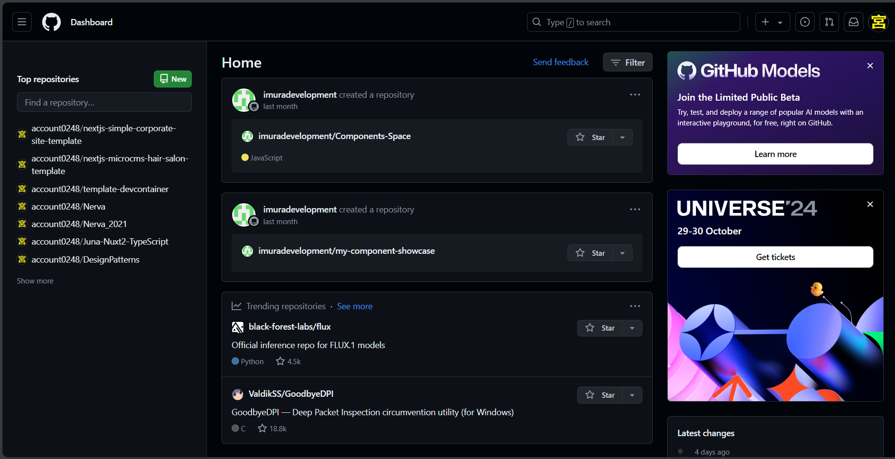

2. **リポジトリのフォークとクローン**

    1. [GitHub のリポジトリ](https://github.com/imuradevelopment/Nuxt3-SSG-TEST)にアクセスします。
    2. ページ右上の「Fork」ボタンをクリックします。  
    例）「Fork」ボタンを押下  
    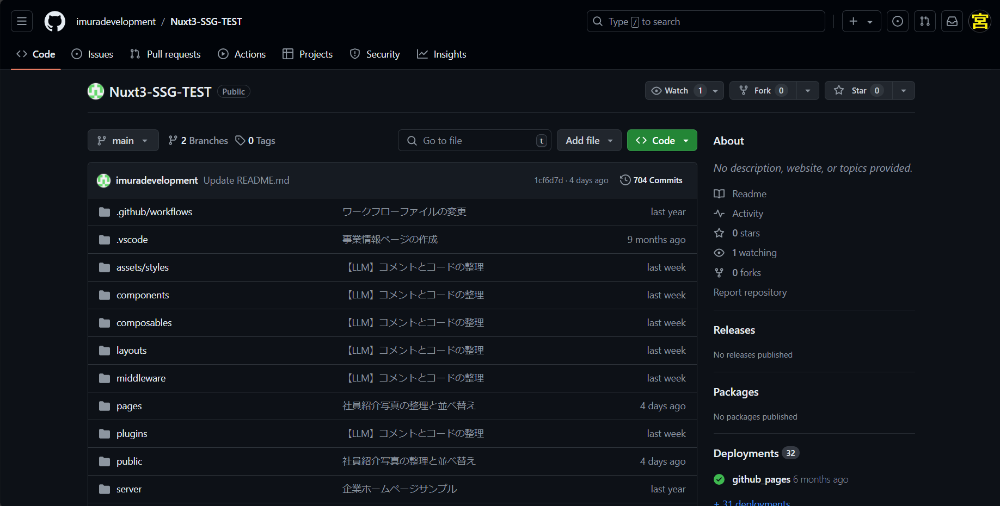  
    例）「Create Fork」ボタンを押下  
    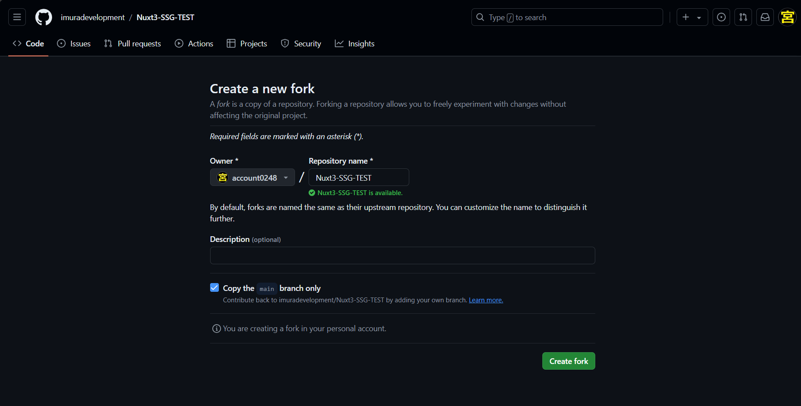  
    3. 自分のアカウントにリポジトリがフォークされます。  
    例）Fork済みのリポジトリ  
    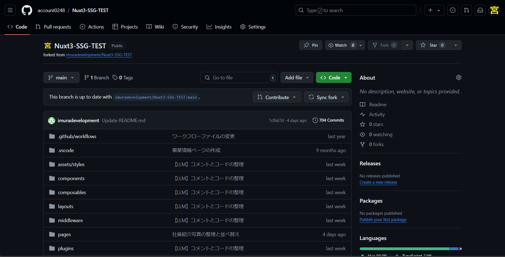  

3. **Codespace の作成**

    1. フォークしたリポジトリを開き、画面右上の「Code」ボタンを押下します。  
    例）「Code」ボタンを押下  
      
    2. 「Create codespace on main」ボタンを押下します。  
    例）「Create codespace on main」ボタンを押下  
    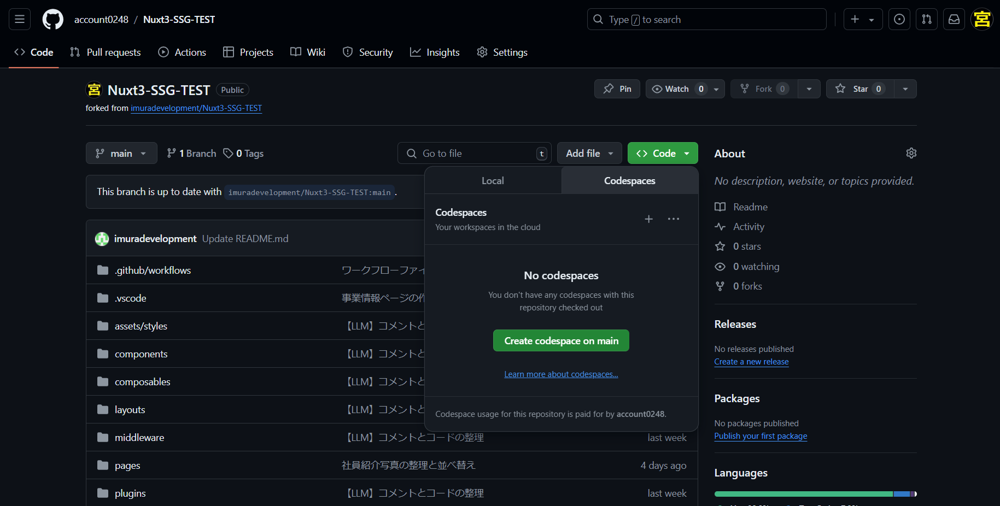  
    3. Codespace の作成が開始され、数分待つと開発環境が準備されます。  
    例）Codespace の作成が開始  
    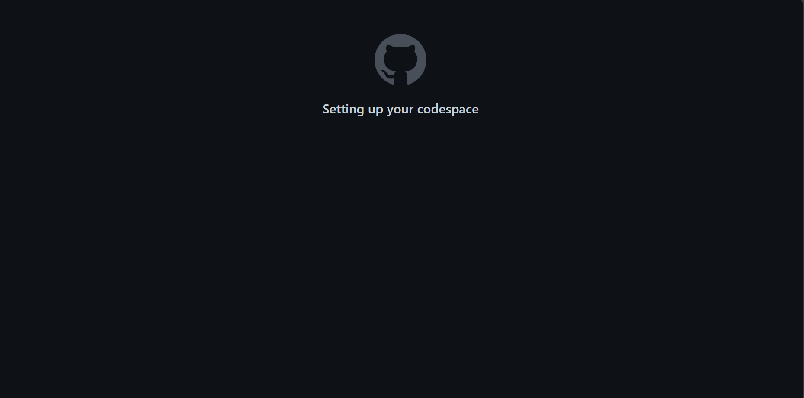  
    例）Codespace の起動  
    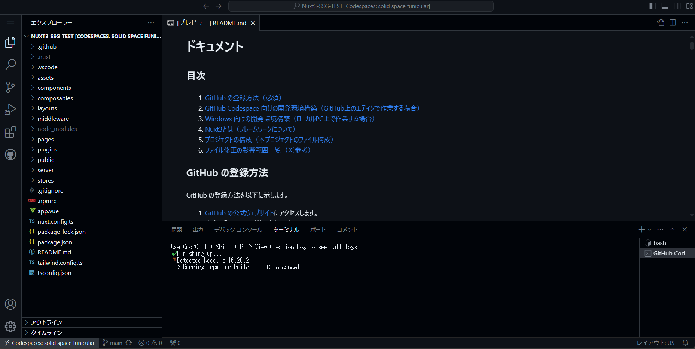  

4. **開発環境の利用**

    1. Codespace が作成されると、ブラウザ上で開発環境が表示されます。
    2. コードの編集、ビルド、デバッグなど、通常の開発作業を行うことができます。

5. **プロジェクトの依存関係のインストールと起動**

    1. ターミナルで以下のコマンドを実行して、プロジェクトの依存関係をインストールします。  

        ```sh
        npm install
        ```

        例）ターミナルに「npm install」を入力しENTER  
        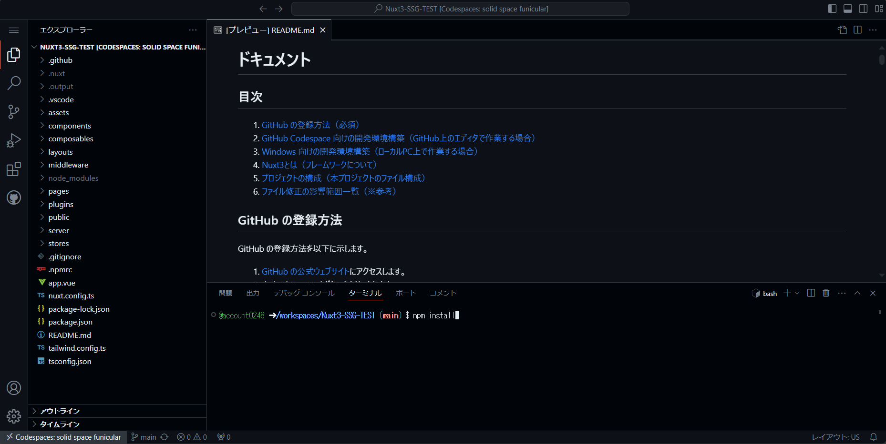  

        例）「npm install」実行後  
        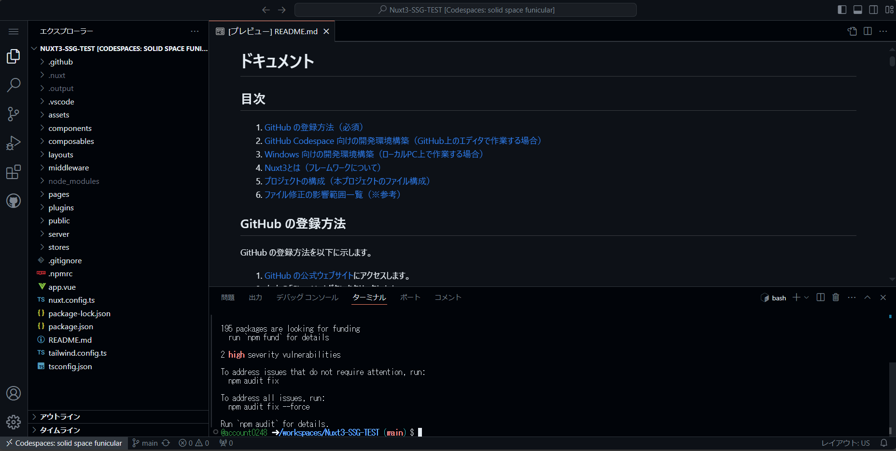  

    2. プロジェクトをビルドし、ローカルサーバーを起動するには、以下のコマンドを実行します。

        ```sh
        npm run generate
        npx serve .output/public
        # Need to install the following packages:
        # serve@14.2.3
        # Ok to proceed? (y) y
        # ↑↑↑↑↑上記が出たら「y」を押下
        ```

        例）ターミナルに「npm run generate」を入力しENTER  
        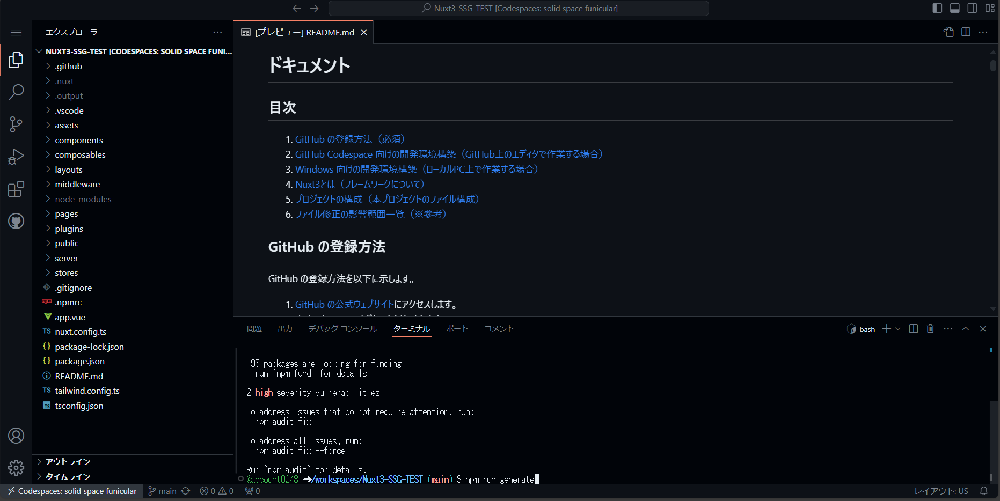  

        例）「npm run generate」実行後、「.output/public」にビルド済みのコードが出力される  
        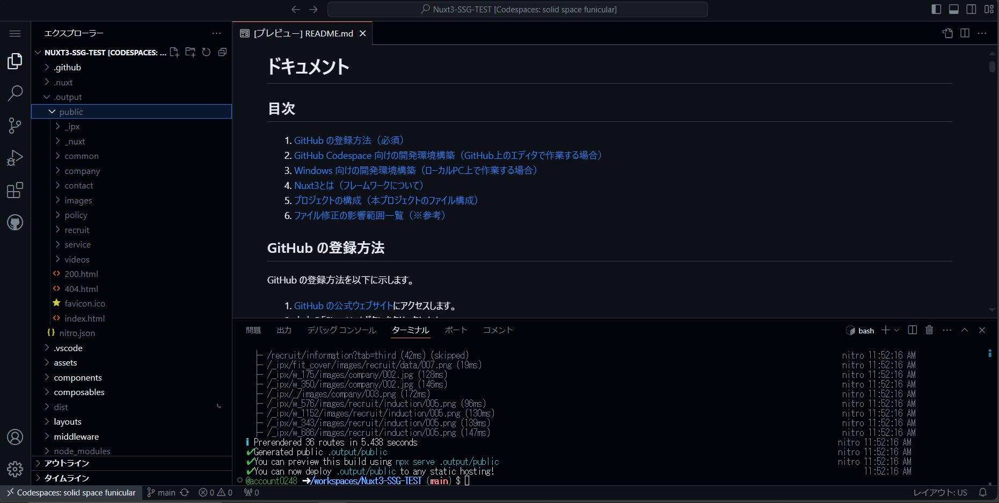  

        例）FTPでデプロイするファイルをDLする場合  
        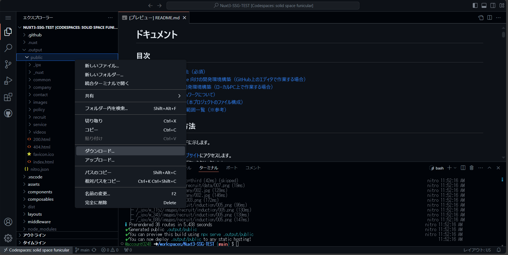  

        例）ターミナルに「npx serve .output/public」を入力しENTER  
        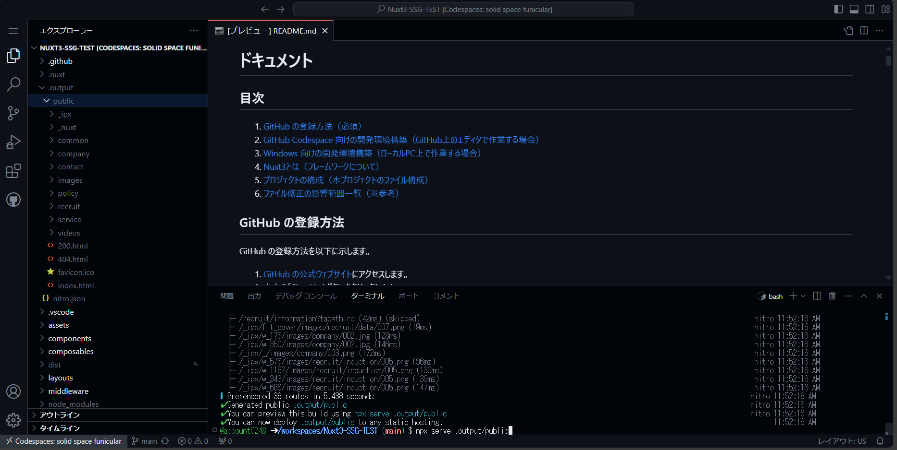  

        例）「npx serve .output/public」実行後、開発サーバーを起動する場合  
        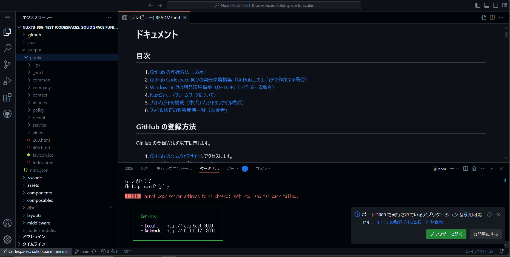  

        例）「`http://localhost:3000`」にアクセス、クラウド環境上でランダムなURLにリダイレクトされます。  
        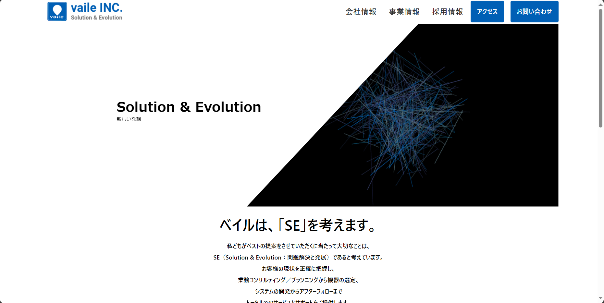  


    3. ビルドとローカルサーバーの起動を一度に行いたい場合は、以下のコマンドを実行します。

        ```sh
        npm run local
        # Need to install the following packages:
        # serve@14.2.3
        # Ok to proceed? (y) y
        # ↑↑↑↑↑上記が出たら「y」を押下
        ```

以上が GitHub Codespace 向けの環境で動かすための手順です。

## Windows 向けの開発環境構築

1. **VSCode のインストール**

    1. [VSCode の公式ウェブサイト](https://code.visualstudio.com/)にアクセスし、VSCode をダウンロードしてインストールします。

2. **Scoop のインストール**

    1. 管理者権限で powershell を起動します（Windows ボタンを押下した後、「powershell」と入力し、右クリックから「管理者として実行」を選択します）。
    2. 下記のコマンドを実行して、Scoop をインストールします。

        ```ps1
        iex (new-object net.webclient).downloadstring('https://get.scoop.sh')
        ```

3. **Scoop を用いた Git のインストール**

    1. powershell で以下のコマンドを実行して、Git をインストールします。

        ```ps1
        scoop install git
        ```

    2. powershell で以下のコマンドを実行して、Git の設定を行います。

        ```ps1
        # 現在の設定を参照
        git config --global --list

        # 以下設定
        # コミット時の名称設定
        git config --global user.name 'Yuta Miyaura'
        # 自分の名前でね、間違ったら下記で消してね
        # git config --global --unset user.name
        git config --global user.email 'imuradevelopmentauth@gmail.com'
        # 自分のメアドでね、間違ったら下記で消してね
        # git config --global --unset user.email
        git config --global init.defaultBranch main
        git config --global core.autocrlf false
        git config --global core.ignorecase false
        git config --global color.ui true
        git config --global core.quotepath false
        ```

4. **Node のインストール**

    1. powershell で以下のコマンドを実行して、Node のバージョンを 18.18.0 に設定します。

        ```ps1
        scoop install nodejs-lts
        nvm install 18.18.0
        nvm use 18.18.0
        ```

5. **GitHub へのログイン**

    1. [GitHub の公式ウェブサイト](https://github.com/)にアクセスします。
    2. 右上の「Sign In」ボタンをクリックします。
    3. 登録済みのユーザー名（またはメールアドレス）とパスワードを入力して、「Sign in」ボタンをクリックします。

6. **リポジトリのフォークとクローン**

    1. [GitHub のリポジトリ](https://github.com/imuradevelopment/Nuxt3-SSG-TEST)にアクセスします。
    2. ページ右上の「Fork」ボタンをクリックします。
    3. 自分のアカウントにリポジトリがフォークされます。
    4. powershell で以下のコマンドを実行して、リポジトリをローカルにクローンします。

        ```ps1
        git clone git@github.com:your-username/Nuxt3-SSG-TEST.git
        ```

7. **プロジェクトの依存関係のインストールと起動**

    1. powershell で以下のコマンドを実行して、プロジェクトの依存関係をインストールします。

        ```ps1
        cd Nuxt3-SSG-TEST
        npm install
        ```

    2. プロジェクトをビルドし、ローカルサーバーを起動するには、以下のコマンドを実行します。

        ```ps1
        npm run generate
        npx serve .output/public
        ```

    3. ビルドとローカルサーバーの起動を一度に行いたい場合は、以下のコマンドを実行します。

        ```ps1
        npm run local
        ```

以上が、このプロジェクトをローカル環境で動かすための手順です。

## Nuxt3とは

### Nuxt3の概要
Nuxt3は、Vue.jsをベースとしたフレームワークで、サーバーサイドレンダリング（SSR）や静的サイト生成（SSG）を簡単に行えるように設計されています。Nuxt3は、SEOに優れたウェブサイトを構築するためのツールを提供し、パフォーマンスの最適化や開発者体験の向上に重点を置いています。

### 基本的なフォルダ構成とその説明

1. **assets**:
   - **説明**: 未加工の静的アセット（画像、スタイルシートなど）を格納するディレクトリです。webpackやviteを通じてプロジェクトに取り込まれます。
   - **例**: `assets/styles/main.css`

2. **components**:
   - **説明**: Vue.jsコンポーネントを格納するディレクトリです。これらのコンポーネントはページや他のコンポーネントからインポートされて使用されます。
   - **例**: `components/Header.vue`

3. **composables**:
   - **説明**: Vue 3のComposition APIフックを格納するディレクトリです。再利用可能なロジックをまとめるために使用します。
   - **例**: `composables/useFetch.js`

4. **layouts**:
   - **説明**: アプリケーションのレイアウトコンポーネントを格納するディレクトリです。異なるページに共通の構造やデザインを提供します。
   - **例**: `layouts/default.vue`

5. **middleware**:
   - **説明**: ページまたはルートがレンダリングされる前に実行される関数を格納するディレクトリです。認証やリダイレクトなどに使用します。
   - **例**: `middleware/auth.js`

6. **pages**:
   - **説明**: アプリケーションのルートを定義するディレクトリです。このディレクトリ内のファイルは自動的にルーティングされます。
   - **例**: `pages/index.vue`, `pages/about.vue`

7. **plugins**:
   - **説明**: Vueプラグインを格納するディレクトリです。プロジェクト全体で使用するプラグインを登録します。
   - **例**: `plugins/axios.js`

8. **public**:
   - **説明**: 静的ファイルを格納するディレクトリです。これらのファイルはビルドプロセスを経ずにそのまま公開されます。
   - **例**: `public/favicon.ico`

9. **server**:
   - **説明**: サーバーサイドのロジックを格納するディレクトリです。APIエンドポイントやミドルウェアを定義します。
   - **例**: `server/api/user.js`

10. **store**:
    - **説明**: アプリケーションの状態管理を行うVuexストアを格納するディレクトリです。
    - **例**: `store/index.js`

11. **nuxt.config.ts**:
    - **説明**: Nuxtアプリケーションの設定ファイルです。モジュール、プラグイン、ビルドオプションなどを設定します。
    - **例**: `nuxt.config.ts`

12. **package.json**:
    - **説明**: プロジェクトの依存関係、スクリプト、メタデータを定義するファイルです。
    - **例**: `package.json`

## プロジェクトの構成

```
Nuxt3-SSG-TEST-main/
    .gitignore               # Gitで無視するファイルやディレクトリを指定
    .npmrc                   # npmの設定ファイル
    README.md                # プロジェクトの概要や設定手順
    app.vue                  # アプリケーションのルートコンポーネント
    nuxt.config.ts           # Nuxtの設定ファイル
    package-lock.json        # 固定された依存関係のバージョン
    package.json             # プロジェクトの依存関係やスクリプト
    tailwind.config.ts       # Tailwind CSSの設定ファイル
    tsconfig.json            # TypeScriptの設定ファイル
    .github/                 # GitHubの設定ファイル
        workflows/           # GitHub Actionsの設定
            main.yml         # GitHub Actionsのワークフロー設定
    .vscode/                 # Visual Studio Code用の設定ファイル
        settings.json        # VSCodeの設定ファイル
    assets/                  # 未加工のアセット（画像やスタイルシートなど）
        styles/              # スタイルシート
            css/             # CSSファイル
                reset.css    # CSSリセットファイル
                style.css    # カスタムスタイル
                tailwind.css # Tailwindのスタイル
            element/         # Element UIのスタイル
                dark.scss    # ダークテーマスタイル
                index.scss   # Element UIのスタイル
    components/              # Vueコンポーネント
        BackgroundPattern.vue        # 背景パターンコンポーネント
        BackgroundPattern2.vue       # 背景パターンコンポーネント2
        BlurGlassCard.vue            # ブラーガラスカードコンポーネント
        BurgerMenu.vue               # ハンバーガーメニューコンポーネント
        Carousel.vue                 # カルーセルコンポーネント
        CarouselEmployee.vue         # 従業員カルーセルコンポーネント
        ClearGlassMaskCard.vue       # クリアガラスマスクカードコンポーネント
        CustomArrowButton.vue        # カスタム矢印ボタンコンポーネント
        CustomFrameCard.vue          # カスタムフレームカードコンポーネント
        CustomTable.vue              # カスタムテーブルコンポーネント
        DevelopmentAchievements.vue  # 開発成果コンポーネント
        Footer.vue                   # フッターコンポーネント
        Header.vue                   # ヘッダーコンポーネント
        HeroDesktop.vue              # デスクトップ用ヒーローコンポーネント
        HeroMobile.vue               # モバイル用ヒーローコンポーネント
        ImageCard.vue                # 画像カードコンポーネント
        PageHeader.vue               # ページヘッダーコンポーネント
        Sidebar.vue                  # サイドバーコンポーネント
        Timeline.vue                 # タイムラインコンポーネント
        VennDiagram.vue              # ベン図コンポーネント
    composables/                      # Vue 3のComposition APIフック
        useScrollToTarget.ts         # ターゲットへスクロールするフック
    layouts/                         # アプリケーションのレイアウト
        default.vue                  # デフォルトレイアウト
        double-column-sidebar.vue    # 二列サイドバーのレイアウト
    middleware/                      # ミドルウェア
        nuxtLinkIntercept.global.ts  # Nuxtリンクのインターセプトミドルウェア
    pages/                           # アプリケーションのページコンポーネント
        company.vue                  # 会社情報ページ
        contact.vue                  # お問い合わせページ
        index.vue                    # ホームページ
        policy.vue                   # ポリシーページ
        service.vue                  # サービスページ
        recruit/                     # 採用関連のページ
            data.vue                 # 採用データページ
            employee.vue             # 採用従業員ページ
            feature.vue              # 採用特徴ページ
            index.vue                # 採用インデックスページ
            induction.vue            # 採用導入ページ
            information.vue          # 採用情報ページ
            message.vue              # 採用メッセージページ
            office.vue               # 採用オフィスページ
            qa.vue                   # 採用Q&Aページ
            welfare.vue              # 採用福利厚生ページ
    plugins/                         # Vueプラグイン
        nuxtLinkIntercept.client.ts  # Nuxtリンクのインターセプトプラグイン
    public/                          # 静的ファイル
        favicon.ico                  # ファビコン
        common/                      # 共通ファイル
            sendemail.php            # メール送信スクリプト
            sitemap.xml              # サイトマップ
        images/                      # 画像ファイル
            common/
                check.svg            # 共通のチェックマーク画像
            company/
                001.jfif             # 会社画像1
                002.jpg              # 会社画像2
                003.png              # 会社画像3
                004.png              # 会社画像4
            contact/
                001.png              # お問い合わせ画像1
            footer/
                policy.png           # フッターポリシー画像
            logo/
                logo.svg             # ロゴ画像
            recruit/
                data/
                    001.png          # 採用データ画像1
                    002.png          # 採用データ画像2
                employee/
                    001.png          # 採用従業員画像1
                    002.jpg          # 採用従業員画像2
                feature/
                    001.png          # 採用特徴画像1
                    002.png          # 採用特徴画像2
                index/
                    001.png          # 採用インデックス画像1
                    002_D.png        # 採用インデックス画像2
                induction/
                    001.png          # 採用導入画像1
                    002.png          # 採用導入画像2
                information/
                    001.png          # 採用情報画像1
                message/
                    001.png          # 採用メッセージ画像1
                office/
                    001.png          # 採用オフィス画像1
                qa/
                    001.png          # 採用Q&A画像1
                welfare/
                    001.png          # 採用福利厚生画像1
            top/
                001.jpg              # トップ画像1
        videos/
            vaile.mp4                # ビデオファイル
    server/                          # サーバーサイドのロジック
        tsconfig.json                # サーバー側のTypeScript設定ファイル
    stores/                          # Vuexストア
        activeIndex.ts               # アクティブインデックスの状態管理
        currentPhotoNumber.ts        # 現在の写真番号の状態管理
        tabStore.ts                  # タブの状態管理
```

## ファイル修正の影響範囲一覧

| ファイル                   | 影響を受けるファイル・コンポーネント                     |
|----------------------------|---------------------------------------------------------|
| layouts/default.vue        | Header.vue, Footer.vue                                   |
| layouts/double-column-sidebar.vue | Header.vue, Sidebar.vue, Footer.vue, BackgroundPattern2.vue |
| pages/company.vue          | CustomFrameCard.vue, CustomTable.vue, ClearGlassMaskCard.vue, PageHeader.vue |
| pages/contact.vue          | CustomArrowButton.vue                                    |
| pages/index.vue            | HeroDesktop.vue, HeroMobile.vue                          |
| pages/policy.vue           | None                                                    |
| pages/service.vue          | CustomFrameCard.vue, VennDiagram.vue, DevelopmentAchievements.vue |
| pages/recruit/data.vue     | None                                                    |
| pages/recruit/employee.vue | CarouselEmployee.vue                                     |
| pages/recruit/feature.vue  | CustomArrowButton.vue, ImageCard.vue, BlurGlassCard.vue  |
| pages/recruit/index.vue    | CustomArrowButton.vue, Carousel.vue, BackgroundPattern.vue |
| pages/recruit/induction.vue | Timeline.vue, ImageCard.vue, BlurGlassCard.vue           |
| pages/recruit/information.vue | BlurGlassCard.vue, CustomArrowButton.vue                 |
| pages/recruit/message.vue  | BlurGlassCard.vue                                        |
| pages/recruit/office.vue   | Carousel.vue                                            |
| pages/recruit/qa.vue       | BlurGlassCard.vue, ClearGlassMaskCard.vue, CustomArrowButton.vue |
| pages/recruit/welfare.vue  | BlurGlassCard.vue                                        |
| components/BackgroundPattern.vue | pages/recruit/index.vue                             |
| components/BackgroundPattern2.vue | layouts/double-column-sidebar.vue                 |
| components/BlurGlassCard.vue | pages/recruit/feature.vue, pages/recruit/induction.vue, pages/recruit/information.vue, pages/recruit/message.vue, pages/recruit/qa.vue, pages/recruit/welfare.vue |
| components/BurgerMenu.vue  | Header.vue                                              |
| components/Carousel.vue    | pages/recruit/index.vue, pages/recruit/office.vue       |
| components/CarouselEmployee.vue | pages/recruit/employee.vue                          |
| components/ClearGlassMaskCard.vue | pages/company.vue, pages/recruit/qa.vue            |
| components/CustomArrowButton.vue | pages/contact.vue, pages/recruit/feature.vue, pages/recruit/index.vue, pages/recruit/information.vue, pages/recruit/qa.vue |
| components/CustomFrameCard.vue | pages/company.vue, pages/service.vue                 |
| components/CustomTable.vue | pages/company.vue                                       |
| components/DevelopmentAchievements.vue | pages/service.vue                           |
| components/Footer.vue      | layouts/default.vue, layouts/double-column-sidebar.vue  |
| components/Header.vue      | layouts/default.vue, layouts/double-column-sidebar.vue, components/BurgerMenu.vue  |
| components/HeroDesktop.vue | pages/index.vue                                         |
| components/HeroMobile.vue  | pages/index.vue                                         |
| components/ImageCard.vue   | pages/recruit/feature.vue, pages/recruit/induction.vue  |
| components/PageHeader.vue  | pages/company.vue                                       |
| components/Sidebar.vue     | layouts/double-column-sidebar.vue                       |
| components/Timeline.vue    | pages/recruit/induction.vue                             |
| components/VennDiagram.vue | pages/service.vue                                       |

## 定期修正箇所一覧

### マイナビ/リクナビリンク、画層差し替え（1年に1度で発生）

- 修正対象ファイルと作業
  - pages\recruit\information.vue（募集情報ページ）
    - URL更新を行う。（以下の抜粋コードのコメントを参照）
  - public\images\recruit\information\002.png（マイナビリンク画像）
    - 画像差し替え。
  - public\images\recruit\information\003.png（リクナビリンク画像）
    - 画像差し替え。

```html
<BlurGlassCard class="self-center max-w-xs">
    <div class="flex flex-col gap-4">
        <div>
            <!-- 以下リクナビリンク修正 -->
            <a href="https://job.rikunabi.com/2025/company/r110010051/" target="_blank"
                rel="noopener noreferrer">
                
            </a>
        </div>
        <div>
            <!-- 以下マイナビリンク修正 -->
            <a href="https://job.mynavi.jp/25/pc/search/corp267137/outline.html" target="_blank"
                rel="noopener noreferrer">
                
            </a>
        </div>
    </div>
</BlurGlassCard>
```

### プライバシーマークの入れ替え（2年に一度発生）

- プライバシーマークロゴの入替
  - 修正対象ファイルと作業
    - public\images\footer\policy.png（プライバシーマーク画像）
      - 画像差し替え。

- 個人情報保護ページの文言修正
  - 修正対象ファイルと作業
    - pages\policy.vue（個人情報保護ページ）
      - 対象行の文言を修正。

### 社員紹介入れ替え手順（不定期で発生）

- 修正対象ファイルと作業
  - pages\recruit\employee.vue（社員紹介ページ）
    - 以下の「# pages\recruit\employee.vue（社員紹介ページ）修正手順」に沿ってその下の修正例のように修正を行う。
  - pages\recruit\index.vue（採用情報ページ）
    - 以下の「# pages\recruit\index.vue（採用情報ページ）修正手順」に沿ってその下の修正例のように修正を行う。
  - public\images\recruit\employee\002.jpg ~ 008.jpg（社員紹介画像）
    - 画像の追加、削除。また、それに伴って上記手順で修正を行う。

```markdown
# pages\recruit\employee.vue（社員紹介ページ）修正手順

次のコード例に示す様にブロック単位でコピーして追加、または削除を行う。

ここでは例として追加を行います。
「008.jpg」のブロックをコピーして下記の様に修正し、末尾に追加。

- src: 
    - 008.jpg → 009.jpg
- alt: 
    - R.T. → X.X.
- introduction: 
    - 若手エンジニア<br />R.T.<br />理系私立大学卒<br />2023年入社 →　若手エンジニア<br />X.X.<br />文系国立大学卒<br />2024年入社
- message1: 
    - 私は、納品予定のシステムに... → 「現在の仕事について教えて下さい。」の回答
- message2: 
    - テストを一つ消化する毎に... → 「この仕事の好きなところはどこですか？」の回答
- message3: 
    - 私が就職活動中に... → 「就職活動へのアドバイスをお願いします。」の回答
- tileColor:
    - 修正なし
- shadowColor:
    - 修正なし
- bgPosition:
    - 修正なし
```

```html
<!-- pages\recruit\index.vue（採用情報ページ）抜粋と修正例 -->
<!-- インタビューセクション -->
<section class="mb-12 md:mb-24">
    <h2 id="recruit-employee02 mb-4"
        class="pl-16 pr-8 w-fit text-white bg-custom-deepBlue text-4xl font-bold leading-loose">
        インタビュー</h2>
    <div class=" mx-4">
        <!-- CarouselEmployeeコンポーネントの呼び出し -->
        <CarouselEmployee :pics="[
            {
                src: '/images/recruit/employee/008.jpg',
                alt: '人物写真R.T.',
                introduction: `<div class='flex h-full items-center justify-end'><div class='h-full w-auto bg-custom-deepBlue/70 text-white flex justify-center items-center'><div class='p-1 md:p-4 text-xs md:text-2xl font-bold leading-5 md:leading-loose text-center'>若手エンジニア<br />R.T.<br />理系私立大学卒<br />2023年入社</div></div></div>`,
                message1: `<p class='message text-sm sm:text-base font-bold sm:leading-7 leading-7'>私は、納品予定のシステムに...</p>`,
                message2: `<p class='message text-sm sm:text-base font-bold sm:leading-7 leading-7'>テストを一つ消化する毎に...</p>`,
                message3: `<p class='message text-sm sm:text-base font-bold sm:leading-7 leading-7'>私が就職活動中に...</p>`,
                tileColor: 'rgba(0, 37, 92, 0.1)',
                shadowColor: 'rgb(0 0 0 / 0.5)',
                bgPosition: 'center'
            },
                        {
                src: '/images/recruit/employee/009.jpg',
                alt: '人物写真X.X.',
                introduction: `<div class='flex h-full items-center justify-end'><div class='h-full w-auto bg-custom-deepBlue/70 text-white flex justify-center items-center'><div class='p-1 md:p-4 text-xs md:text-2xl font-bold leading-5 md:leading-loose text-center'>若手エンジニア<br />X.X.<br />文系国立大学卒<br />2024年入社</div></div></div>`,
                message1: `<p class='message text-sm sm:text-base font-bold sm:leading-7 leading-7'>「現在の仕事について教えて下さい。」の回答</p>`,
                message2: `<p class='message text-sm sm:text-base font-bold sm:leading-7 leading-7'>「この仕事の好きなところはどこですか？」の回答</p>`,
                message3: `<p class='message text-sm sm:text-base font-bold sm:leading-7 leading-7'>「就職活動へのアドバイスをお願いします。」の回答</p>`,
                tileColor: 'rgba(0, 37, 92, 0.1)',
                shadowColor: 'rgb(0 0 0 / 0.5)',
                bgPosition: 'center'
            },
        ]"></CarouselEmployee>
    </div>
</section>
```

```markdown
# pages\recruit\index.vue（採用情報ページ）修正手順

次のコード例に示す様にブロック単位でコピーして追加、または削除を行う。

ここでは例として追加を行います。
「008.jpg」のブロックをコピーして下記の様に修正し、末尾に追加を行う。

- src: 
    - 008.jpg → 009.jpg
- alt: 
    - R.T. → X.X.
- mainText:
    - R.T. → X.X.
- subText: 
    - 若手エンジニア<br>理系私立大学卒<br>2023年入社 → 若手エンジニア<br>文系国立大学卒<br>2024年入社
- tileColor:
    - 修正なし
- shadowColor:
    - 修正なし
- bgPosition:
    - 修正なし
```

```html
<!-- pages\recruit\index.vue（採用情報ページ）抜粋と修正例 -->
<!-- 社員紹介セクション -->
<section class="my-24">
    <BackgroundPattern>
    </BackgroundPattern>
    <div class="w-full flex flex-col">
        <h2 id="recruit09" class="pl-16 pr-8 w-fit text-white bg-custom-deepBlue text-4xl font-bold leading-loose">
            社員紹介
        </h2>
        <div class="mx-4 mt-8 mb-4 flex justify-center items-center">
            <div class="max-w-xl">
                <Carousel :pics="[
                    {
                        src: '/images/recruit/employee/008.jpg',
                        alt: '人物写真R.T.',
                        mainText: `<div class='text-center px-4 text-2xl font-bold leading-loose min-w-[6rem]'>R.T.</div>`,
                        subText: `<div class='flex flex-col min-w-[210px]'><div class='grow text-center text-sm sm:text-base font-bold'>若手エンジニア<br>理系私立大学卒<br>2023年入社</div><a href='/recruit/employee' class='flex justify-center items-center border border-b-2 mt-2 py-1 px-4'>詳しく見る<i class='el-icon ml-2' style='font-size: 20px;'><svg xmlns='http://www.w3.org/2000/svg' viewBox='0 0 1024 1024'><path fill='currentColor' d='M160 224a32 32 0 0 0-32 32v512a32 32 0 0 0 32 32h704a32 32 0 0 0 32-32V256a32 32 0 0 0-32-32zm0-64h704a96 96 0 0 1 96 96v512a96 96 0 0 1-96 96H160a96 96 0 0 1-96-96V256a96 96 0 0 1 96-96'></path><path fill='currentColor' d='M704 320a64 64 0 1 1 0 128 64 64 0 0 1 0-128M288 448h256q32 0 32 32t-32 32H288q-32 0-32-32t32-32m0 128h256q32 0 32 32t-32 32H288q-32 0-32-32t32-32'></path></svg></i></a></div>`,
                        tileColor: 'rgba(0, 37, 92, 0.1)',
                        shadowColor: 'rgb(0 0 0 / 0.5)',
                        bgPosition: 'center'
                    },    
                    {
                        src: '/images/recruit/employee/009.jpg',
                        alt: '人物写真X.X.',
                        mainText: `<div class='text-center px-4 text-2xl font-bold leading-loose min-w-[6rem]'>X.X.</div>`,
                        subText: `<div class='flex flex-col min-w-[210px]'><div class='grow text-center text-sm sm:text-base font-bold'>若手エンジニア<br>理系私立大学卒<br>2023年入社</div><a href='/recruit/employee' class='flex justify-center items-center border border-b-2 mt-2 py-1 px-4'>詳しく見る<i class='el-icon ml-2' style='font-size: 20px;'><svg xmlns='http://www.w3.org/2000/svg' viewBox='0 0 1024 1024'><path fill='currentColor' d='M160 224a32 32 0 0 0-32 32v512a32 32 0 0 0 32 32h704a32 32 0 0 0 32-32V256a32 32 0 0 0-32-32zm0-64h704a96 96 0 0 1 96 96v512a96 96 0 0 1-96 96H160a96 96 0 0 1-96-96V256a96 96 0 0 1 96-96'></path><path fill='currentColor' d='M704 320a64 64 0 1 1 0 128 64 64 0 0 1 0-128M288 448h256q32 0 32 32t-32 32H288q-32 0-32-32t32-32m0 128h256q32 0 32 32t-32 32H288q-32 0-32-32t32-32'></path></svg></i></a></div>`,
                        tileColor: 'rgba(0, 37, 92, 0.1)',
                        shadowColor: 'rgb(0 0 0 / 0.5)',
                        bgPosition: 'center'
                    },
                ]"></Carousel>
            </div>
        </div>
    </div>
</section>
```

### オフィス紹介写真の入替手順（不定期で発生）

- 修正対象ファイルと作業
  - pages\recruit\office.vue（オフィス紹介ページ）
    - 以下の「# pages\recruit\office.vue（オフィス紹介ページ）修正手順」に沿ってその下の修正例のように修正を行う。
  - public\images\recruit\office\002.png ~ 009.png（オフィス紹介画像）
    - 画像の追加、削除。また、それに伴って上記手順で修正を行う。

```markdown
# pages\recruit\office.vue（オフィス紹介ページ）修正手順

次のコード例に示す様にブロック単位でコピーして追加、または削除を行う。

ここでは例として追加を行います。
「009.jpg」のブロックをコピーして下記の様に修正し、末尾に追加。

- src: 
    - 009.jpg → 010.jpg
- alt: 
    - 職場風景２ → 画像の説明テキスト
- mainText:
    - 職場風景２ → 画面表示文字列。画像タイトル。
- subText:
    - 実際の職場環境の雰囲気。<br />エンジニアに人気のBaronチェアやサブディスプレイ等完備。 → 画面表示文字列。下部に表示される画像の説明。
- tileColor:
    - 修正なし
- shadowColor:
    - 修正なし
- bgPosition:
    - 修正なし
```

```html
<!-- pages\recruit\office.vue（オフィス紹介ページ）抜粋と修正例 -->
<!-- オフィス内部の各部屋やエリアの紹介セクション -->
<section class="mb-12 md:mb-24 ">
    <div class="mx-4 flex justify-center items-center">
        <div class="max-auto">
            <!-- オフィス内部の写真を表示するカルーセルコンポーネント -->
            <Carousel :pics="[
                {
                    src: '/images/recruit/office/009.png',
                    alt: '職場風景２',
                    mainText: `<h3 class='px-4 text-2xl font-bold leading-loose'>職場風景２</h3>`,
                    subText: `<p class=' text-sm sm:text-base font-bold sm:leading-7 leading-7'>実際の職場環境の雰囲気。<br class='' />エンジニアに人気のBaronチェアやサブディスプレイ等完備。</p>`,
                    tileColor: 'rgba(0, 37, 92, 0.1)',
                    shadowColor: 'rgb(0 0 0 / 0.5)',
                    bgPosition: 'center'
                },
                {
                    src: '/images/recruit/office/010.png',
                    alt: '画像の説明テキスト',
                    mainText: `<h3 class='px-4 text-2xl font-bold leading-loose'>画面表示文字列。画像タイトル。</h3>`,
                    subText: `<p class=' text-sm sm:text-base font-bold sm:leading-7 leading-7'>画面表示文字列。下部に表示される画像の説明。</p>`,
                    tileColor: 'rgba(0, 37, 92, 0.1)',
                    shadowColor: 'rgb(0 0 0 / 0.5)',
                    bgPosition: 'center'
                },
            ]"></Carousel>
        </div>
    </div>
</section>

```

### 地図の修正・更新方法（不定期で発生）

- 修正対象ファイルと作業
  - Map.xlsx（地図の画像元）
    - 廃店などによる修正を行う。
  - public\images\company\003.png（地図の画像）
    - ペイントなどでエクセルから画像を生成して再配置する。

### 会社概要の文言変更（年1回、もしくは不定期で発生）

- 修正対象ファイルと作業
  - pages\company.vue（会社情報ページ）
    - コアパートナー・主要取引先の追加・削除を行う。以下の「# コアパートナー・主要取引先の追加・削除」を参照してコメントの指示に従って修正を行う。
    - 技術者数の増減を行う。以下の「# 技術者数の増減」を参照してコメントの指示に従って修正を行う。

```html
<!-- 
# コアパートナー・主要取引先の追加・削除

    {
        column1: "事業内容",
        column2: "情報サービス業"
    },
    {
    column1: "主要取引先",
    column2: 'ここに以下の内容を修正して1行で記載' 
    },
-->

<!--  コアパートナー、主要取引先を追記、削除し「1行」にする -->
<div style="display: flex; justify-content: stretch; align-items: center; margin: 0.5rem 0">
    <hr style="width: calc(50% - 4rem); border-color: rgba(209, 213, 219, 0.9)" />
    <div style="padding: 0 1rem">コアパートナー</div>
    <hr style="width: calc(50% - 4rem); border-color: rgba(209, 213, 219, 0.9)" />
</div>
日本アイ・ビー・エム株式会社<br />
コベルコシステム株式会社<br />
三井情報株式会社<br />
<!-- コアパートナーを追記・削除、改行「<br />」を忘れないように注意 -->

<div style="display: flex; justify-content: stretch; align-items: center; margin: 0.5rem 0">
    <hr style="width: calc(50% - 3.5rem); border-color: rgba(209, 213, 219, 0.9)" />
    <div style="padding: 0 1rem">主要取引先</div>
    <hr style="width: calc(50% - 3.5rem); border-color: rgba(209, 213, 219, 0.9)" />
</div>
NECネクサソリューションズ株式会社<br />
日本電気株式会社（NEC）<br />
NTTコムソリューションズ株式会社<br />
株式会社TBK<br />
デロイト・トーマツ・リスクアドバイザリー株式会社<br />
日本タタ・コンサルタンシー・サービシズ株式会社<br />
富士フイルムシステムサービス株式会社<br />
富士通株式会社
<!-- 主要取引先を追記・削除、改行「<br />」を忘れないように注意 -->
```

```js
// # 技術者数の増減
// column2の内容を修正。上記の「# コアパートナー・主要取引先の追加・削除」のようにhtml構文も使用できます。
  {
    column1: "技術者数",
    column2: '250名（社員100名、契約社員20名、協力会社技術者130名）'
  },
```

### 各種データの文言修正（年1回、もしくは不定期で発生）

- 修正対象ファイルと作業
  - pages\recruit\data.vue（各種データページ）
    - 基本的にコメントでパネル毎に区切られているので、パネル内項目変更は各パネル内で繰り返している要素に対して追加、削除、編集を行う。例として以下の「# パネル内項目の追加、削除、編集」を参照してください。
    - パネル自体の追加は「追加したいスタイルの既存のパネル」をコピーして編集し、任意の場所に追加を行う。画面全体のパネルのレイアウトは自動で適切に配置されるはずです。
  - public\images\recruit\data\001.png ~ 009.png（パネル内で使用されているアイコン画像）
    - 例として以下の「# パネル内項目の追加、削除、編集」を参照してください。下部の「# アイコン画像の差し替え」。

```html
<!-- # パネル内項目の追加、削除、編集 -->
<!-- 男女割合カード -->
<div class="data-card card-text">
    <div class="pancake-stack text-custom-deepBlue">
        <div class="text-center text-4xl tracking-widest font-bold">
            男女割合
        </div>
        <hr class="mx-4 mb-4 mt-4 border border-custom-deepBlue" />
        <div class="pl-4 w-4/5 horizontal-center">
            <ul class="list-disc text-left text-lg font-bold">
                <li>
                    <div class="inline-flex justify-between items-center w-4/5">
                        <div>
                            男性
                        </div>
                        <div>
                            <!-- %編集 -->
                            88.4%
                        </div>
                    </div>
                </li>
                <li>
                    <div class="inline-flex justify-between items-center w-4/5">
                        <div>
                            女性
                        </div>
                        <div>
                            10.6%
                        </div>
                    </div>
                </li>
                <!-- パネル内項目追加（↓↓↓） -->
                <li>
                    <div class="inline-flex justify-between items-center w-4/5">
                        <div>
                            その他
                        </div>
                        <div>
                            1.0%
                        </div>
                    </div>
                </li>
                <!-- パネル内項目追加（↑↑↑） -->
            </ul>
        </div>
        <div class="flex justify-center items-center">
            <!-- 
             # アイコン画像の差し替え
             画像のパスは下記の「src」のパスを参照して差し替え
              -->
            <NuxtImg class="w-28 h-28" fit="cover" src="/images/recruit/data/009.png" />
        </div>
    </div>
</div>
```

### 募集情報の修正（年1回、もしくは不定期で発生）

　etc）項目(行)の追加、文言修正

- 修正対象ファイルと作業
  - pages\recruit\information.vue（募集情報ページ）
    - 項目（行）の追加と文言修正を行う。下記の「# 項目（行）の追加と文言修正」を参照して下さい。

```html
<!-- 
 # 項目（行）の追加と文言修正

 例えば下記の様に「新卒採用」のタブの項目（行）追加と文言修正を行います。
 ここでは「応募資格の行ブロック（構成は同じなので任意の行ブロック）」をコピーし、行ごとに区切られているコメントを参照して追加したい場所（ここでは「応募資格のブロックの下の行」）にブロックを追加し、文言修正を行う。

 -->

<!-- 新卒採用タブ -->
<el-tab-pane label="新卒採用" name="first">
    <!--
     新卒採用は「name="first"」 
     キャリア採用は「name="second"」
     契約社員採用は「name="third"」
     の名称がそれぞれついています。
     -->
    <section>
        <!-- ぼかしガラスカード -->
        <BlurGlassCard color="rgba(0, 37, 92, 0.6)" :blur=2 class="text-white">
            <div>
                <!-- 募集情報 -->
                <div class="flex flex-nowrap">
                    ...
                </div>
                <!-- 応募資格 -->
                <div class="flex flex-nowrap">
                    <div
                        class="w-1/3 text-base leading-loose bg-custom-deepBlue/20 border-b border-custom-deepBlue/30 flex justify-center items-center">
                        応募資格</div>
                    <div
                        class="w-2/3 pl-2 text-xs md:text-sm leading-loose md:leading-loose border-b border-custom-deepBlue/30 flex items-center">
                        学部・学科やコンピュータに対する知識は問いません。
                    </div>
                </div>
                <!-- 
                 # 追加項目（行）と文言修正
                 「応募資格などの任意のブロックをコピーして追加したい行の場所にブロックを追加」 -->
                <div class="flex flex-nowrap">
                    <div
                        class="w-1/3 text-base leading-loose bg-custom-deepBlue/20 border-b border-custom-deepBlue/30 flex justify-center items-center">
                        追加項目（行の左の列）の記載内容</div>
                    <div
                        class="w-2/3 pl-2 text-xs md:text-sm leading-loose md:leading-loose border-b border-custom-deepBlue/30 flex items-center">
                        追加項目（行の右の列）の記載内容
                    </div>
                </div>
                <!-- 雇用形態 -->
                <div class="flex flex-nowrap">
                    ...
                </div>
                <!-- 本社地 -->
                <div class="flex flex-nowrap">
                    ...
                </div>
                <!-- 勤務地 -->
                <div class="flex flex-nowrap">
                    ...
                </div>
                <!-- 勤務時間 -->
                <div class="flex flex-nowrap">
                    ...
                </div>
                <!-- 休日 -->
                <div class="flex flex-nowrap">
                    ...
                </div>
                <!-- 休暇 -->
                <div class="flex flex-nowrap">
                    ...
                </div>
                <!-- 給与 -->
                <div class="flex flex-nowrap">
                    ...
                </div>
                <!-- 諸手当 -->
                <div class="flex flex-nowrap">
                    ...
                </div>
                <!-- 昇給 -->
                <div class="flex flex-nowrap">
                    ...
                </div>
                <!-- 賞与 -->
                <div class="flex flex-nowrap">
                    ...
                </div>
                <!-- 福利厚生 -->
                <div class="flex flex-nowrap">
                    ...
                </div>
                <!-- 応募の流れ -->
                <div class="flex flex-nowrap">
                    ...
                </div>
            </div>
        </BlurGlassCard>
    </section>
</el-tab-pane>
```
